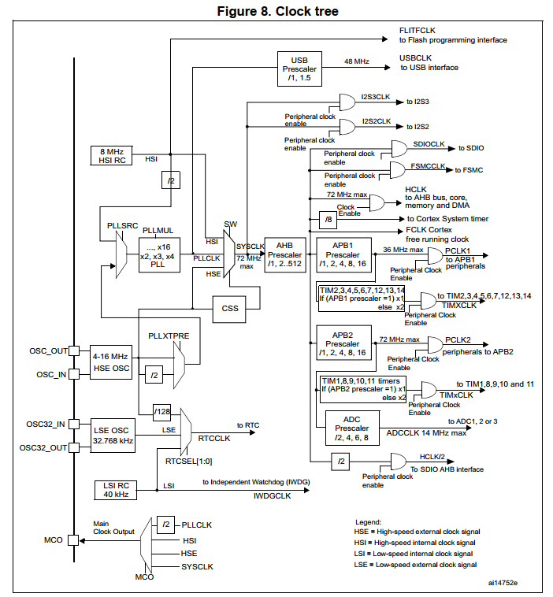
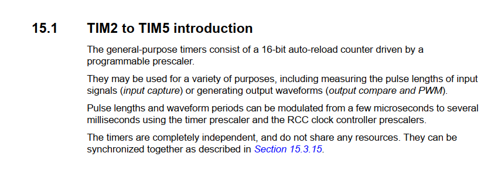
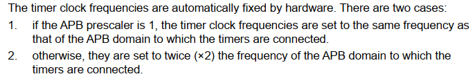

# Bài 4 - Hẹn giờ bằng Timer (P1-Cấu hình Timer)

## Nội dung chính

- Cấu hình timer cho EPS32 để tạo delay chính xác.

- Sử dụng delay mới tạo để cho Led nháy.

***File code kết quả: [Link](https://github.com/NguyenVuTatKhang/EmbeddedSystemNhom1/blob/main/bai4/delay_timer/user/main.c)***

## Các bước thực thi

### 1. Cấu hình cho Led (PA0)

_Để cấu hình Led cho PA0, chúng ta thực hiện các bước sau:_

- Bật clock cho GPIOA:

```c
RCC_APB2PeriphClockCmd(RCC_APB2Periph_GPIOA, ENABLE);
```

- Cấu hình cho chân PA0 ở trạng thái Output - Pushpull, tốc độ 50MHz:

```c
GPIO_InitTypeDef GPIO_InitStruct;
GPIO_InitStruct.GPIO_Mode  = GPIO_Mode_Out_PP;
GPIO_InitStruct.GPIO_Pin   = GPIO_Pin_0;
GPIO_InitStruct.GPIO_Speed = GPIO_Speed_50MHz;
GPIO_Init(GPIOA, &GPIO_InitStruct);
```

### 2. Cấu hình cho Timer (TIM2)

- Để tạo hàm delay bằng Timer, cần cấu hình bộ đếm cơ bản:

```c
TIM_TimeBaseInitTypeDef Timer_InitStruct;
RCC_APB1PeriphClockCmd(RCC_APB1Periph_TIM2, ENABLE);

Timer_InitStruct.TIM_Period              = 65535;       
Timer_InitStruct.TIM_Prescaler           = 72 - 1;       
Timer_InitStruct.TIM_CounterMode         = TIM_CounterMode_Up;
Timer_InitStruct.TIM_RepetitionCounter   = 0;
Timer_InitStruct.TIM_ClockDivision       = 0;
TIM_TimeBaseInit(TIM2, &Timer_InitStruct);
```

***Chú ý:***

Mặc dù tại trang số 126 của Datasheet, có sơ đồ clocktree như sau:



_Trong đó, TIM2 thuộc BP1 có max là 36MHz, nhưng vẫn cấu hình TIM2 của period và prescale như dưới đây:_

- Sử dụng 65535 trong TIM_Period tức 2^16 - 1 là để đếm từ 0 đến 65535 do bộ đếm timer cần 16bits tương ứng vì bộ đếm thanh ghi TIM2-5 introdution tại trang 365 đã ghi như sau: 



Tức timer này sẽ sử dụng 16bits auto-load để đếm

- Sử dụng 72 - 1 trong TIM_Prescaler do:

	+ Trong Datasheet có ghi quy tắc như ảnh sau tại trang số 127:

	
	
	Nghĩa là nếu prescale của APB là 1 thì sẽ giữ nguyên còn không thì sẽ phải nhân 2 lên. Trong khi đó, PPRE(prescale) bằng 1 thường sẽ được mặc định dùng là systemtick nếu người dùng không thay đổi, nên PPRE của timer sẽ phải thay đổi và thường dùng PPRE bằng 2.
	
	+ Prescale sẽ đếm từ 71 về 0, tức 72 số. Do đó, khi chia 72 cho 72MHz (x2 của 36MHz do PPRE bằng 2) sẽ được 1us. Lúc này nếu muốn đếm lên 1ms sẽ tăng thêm 1000 là 72000 hoặc tạo 1 hàm khác như dưới đây.
	

### 3. Xây dựng hàm delay dựa vào Timer

- Hàm tạo delay 1ms:

```c
void delay_1ms(){ 	
	TIM_Cmd(TIM2, ENABLE);
	TIM_SetCounter(TIM2, 0);
	while(TIM_GetCounter(TIM2) < 1000);
	TIM_Cmd(TIM2, DISABLE);
}
```

- Hàm delay với giá trị được đưa vào:

```c
void delay_ms(int time_delay){
	while(time_delay--){
		delay_1ms();
	}
}
```

### 4. Hàm main() thực thi nhấp nháy Led

- Tại vòng lặp while(1), Led tại PA0 sẽ được bật/tắt luân phiên với chu kỳ 1 giây:

```
int main(){
	Led_Config();
	Timer_Config();

	while(1){
		GPIO_ResetBits(GPIOA, GPIO_Pin_0); 
		delay_ms(1000);
		GPIO_SetBits(GPIOA, GPIO_Pin_0);   
		delay_ms(1000);
	}
}
```
## Video demo của nhóm 

_Video demo kết quả của nhóm sẽ được đặt tại link sau:_
[Link](https://drive.google.com/file/d/1XhjwcRYCdKcMpeQfWnXZOgvtWQ7EwWr5/view?usp=sharing)