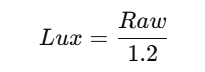

# Bài 6 - Giao tiếp I2C

## Nội dung bài tập

_Yêu cầu của bài tập_

- Cấu hình STM32 là master I2C

- Giao tiếp với một EEPROM hoặc cảm biến I2C để đọc/ghi dữ liệu.

- Hiển thị dữ liệu đọc được lên màn hình terminal qua UART.

***File code kết quả [Link]()***

## Các bước thực thi

***Ở bài tập này, nhóm đã lựa chọn sử dụng module cảm biến ánh sáng, tức là BH1750 để thực hiện bài tập giao tiếp I2C, chi tiết sẽ như dưới đây***

### 1. Khai báo địa chỉ BH1750

_Theo datasheet, chân ADDR chọn địa chỉ I2C:_

- VCC – nguồn cung cấp

- GND – mass

- SCL – chân clock I2C

- SDA – chân data I2C

- ADDR - chon dia chi I2C:

	+ GND = 0x23

	+ VCC = 0x5C

_Note: Trong code, ADDR nối VCC nên địa chỉ là 0x5C._

***Chú ý: Lý do cần dịch trái đi 1 bit như dòng dưới đây:***

```c
#define BH1750_ADDR  (0x5C<<1)
```

Do:

- I2C gửi 8 bit, gồm 7 bit địa chỉ + 1 bit R/W (đọc/ghi).  

-> Nên cần dịch trái 1 để đẩy 7 bit địa chỉ lên vị trí [7–1], còn vị trí [0] để dành cho bit R/W.  

### 2. Cấu hình GPIO cho I2C (PB6 – SCL, PB7 – SDA)

- Bật clock cho GPIOB.

```c
RCC_APB2PeriphClockCmd(RCC_APB2Periph_GPIOB, ENABLE);
```

- Đặt chế độ Alternate Function Open-Drain, tốc độ 50 MHz.

```c
GPIO_InitStruct.GPIO_Pin = GPIO_Pin_6 | GPIO_Pin_7;
GPIO_InitStruct.GPIO_Speed = GPIO_Speed_50MHz;
GPIO_InitStruct.GPIO_Mode = GPIO_Mode_AF_OD;   
GPIO_Init(GPIOB, &GPIO_InitStruct);
```

### 3. Cấu hình I2C1 làm Master

Bật clock cho I2C1, reset, sau đó cấu hình:

Tốc độ: 100 kHz (Standard Mode).

DutyCycle = 2 (thường dùng).

OwnAddress1 = 0x00 (không quan trọng vì STM32 là master).

Bật ACK để nhận dữ liệu.

Địa chỉ 7-bit.

RCC_APB1PeriphClockCmd(RCC_APB1Periph_I2C1, ENABLE);
I2C_DeInit(I2C1);

I2C_InitStruct.I2C_ClockSpeed = 100000;     
I2C_InitStruct.I2C_Mode = I2C_Mode_I2C;         
I2C_InitStruct.I2C_DutyCycle = I2C_DutyCycle_2;    
I2C_InitStruct.I2C_OwnAddress1 = 0x00; 
I2C_InitStruct.I2C_Ack = I2C_Ack_Enable;
I2C_InitStruct.I2C_AcknowledgedAddress = I2C_AcknowledgedAddress_7bit; 

I2C_Init(I2C1, &I2C_InitStruct);
I2C_Cmd(I2C1, ENABLE);

### 4. Hàm ghi dữ liệu tới slave I2C

Quy trình:

Gửi START.

Gửi địa chỉ slave (BH1750) với bit ghi.

Gửi 1 byte dữ liệu.

Gửi STOP.

void I2C_WriteByte(uint8_t addr, uint8_t data) {
    I2C_GenerateSTART(I2C1, ENABLE);
    while(!I2C_CheckEvent(I2C1, I2C_EVENT_MASTER_MODE_SELECT));

    I2C_Send7bitAddress(I2C1, addr, I2C_Direction_Transmitter);
    while(!I2C_CheckEvent(I2C1, I2C_EVENT_MASTER_TRANSMITTER_MODE_SELECTED));

    I2C_SendData(I2C1, data);
    while(!I2C_CheckEvent(I2C1, I2C_EVENT_MASTER_BYTE_TRANSMITTED));

    I2C_GenerateSTOP(I2C1, ENABLE);
}

### 5. Hàm đọc nhiều byte từ slave I2C

Quy trình:

Gửi START.

Gửi địa chỉ slave với bit đọc.

Đọc lần lượt các byte, byte cuối cùng gửi NACK + STOP.

Lưu dữ liệu vào buffer.

void I2C_ReadMulti(uint8_t addr, uint8_t *buf, uint8_t len) {
    I2C_GenerateSTART(I2C1, ENABLE);
    while(!I2C_CheckEvent(I2C1, I2C_EVENT_MASTER_MODE_SELECT));

    I2C_Send7bitAddress(I2C1, addr, I2C_Direction_Receiver);
    while(!I2C_CheckEvent(I2C1, I2C_EVENT_MASTER_RECEIVER_MODE_SELECTED));

    while(len) {
        if(len == 1) {
            I2C_AcknowledgeConfig(I2C1, DISABLE);
            I2C_GenerateSTOP(I2C1, ENABLE);
        }
        if(I2C_CheckEvent(I2C1, I2C_EVENT_MASTER_BYTE_RECEIVED)) {
            *buf = I2C_ReceiveData(I2C1);
            buf++;
            len--;
        }
    }
    I2C_AcknowledgeConfig(I2C1, ENABLE);
}

### 6. Khởi tạo cảm biến BH1750

***Chú ý: Một số lệnh của BH1750 được trích dẫn trong tập lệnh:***

* Lệnh nguồn:  
	+ 0x00: Power down, không đo dữ liệu.  
	+ 0x01: Power on, chờ lệnh tiếp theo.  
	+ 0x07: Reset, xóa thanh ghi dữ liệu.  

* Chế độ đo:  
	* Đo liên tục:  
		+ 0x10: Continuous H-Resolution Mode, độ phân giải 1 lx, thời gian hoàn thành phép đo ~120 ms.  
		+ 0x11: Continuous H-Resolution 2, độ phân giải 0.5 lx, thời gian hoàn thành phép đo ~120 ms.  
		+ 0x13: Continuous L-Resolution, độ phân giải 4 lx, thời gian hoàn thành phép đo ~16 ms.  

	* Đo 1 lần → Power down:  
		+ 0x20: One-Time H-Resolution, độ phân giải 1 lx, thời gian hoàn thành phép đo ~120 ms.  
		+ 0x21: One-Time H-Resolution 2, độ phân giải 0.5 lx, thời gian hoàn thành phép đo ~120 ms.  
		+ 0x23: One-Time L-Resolution, độ phân giải 4 lx, thời gian hoàn thành phép đo ~16 ms.  

Bật nguồn (Power ON).

Reset thanh ghi dữ liệu.

Chọn chế độ đo liên tục, độ phân giải cao (1 lx, ~120 ms).

void BH1750_Init(void) {
    I2C_WriteByte(BH1750_ADDR, 0x01); // Power ON
    I2C_WriteByte(BH1750_ADDR, 0x07); // Reset
    I2C_WriteByte(BH1750_ADDR, 0x10); // Continuous H-Resolution Mode
}

### 7. Đọc giá trị ánh sáng từ BH1750

Đọc 2 byte dữ liệu liên tiếp (MSB, LSB).

Ghép thành số 16-bit thô (raw).

Đổi sang lux theo công thức trong datasheet:



uint16_t BH1750_ReadLight(void) {
    uint8_t buf[2];
    uint16_t raw;

    I2C_ReadMulti(BH1750_ADDR, buf, 2);
    raw = (buf[0] << 8) | buf[1];

    return (uint16_t)(raw / 1.2f);
}

### 8. Cấu hình UART1 để hiển thị dữ liệu

Bật clock cho GPIOA và USART1.

PA9 = TX (AF_PP), PA10 = RX (IN_FLOATING).

Tốc độ baud = 9600, 8N1, không dùng flow control.

Kết nối với terminal để quan sát dữ liệu.

RCC_APB2PeriphClockCmd(RCC_APB2Periph_GPIOA, ENABLE);
RCC_APB2PeriphClockCmd(RCC_APB2Periph_USART1, ENABLE);

gpio.GPIO_Pin = GPIO_Pin_9;
gpio.GPIO_Mode = GPIO_Mode_AF_PP;
gpio.GPIO_Speed = GPIO_Speed_50MHz;
GPIO_Init(GPIOA, &gpio);

gpio.GPIO_Pin = GPIO_Pin_10;
gpio.GPIO_Mode = GPIO_Mode_IN_FLOATING;
GPIO_Init(GPIOA, &gpio);

usart.USART_BaudRate = 9600;
usart.USART_WordLength = USART_WordLength_8b;
usart.USART_StopBits = USART_StopBits_1;
usart.USART_Parity = USART_Parity_No;
usart.USART_HardwareFlowControl = USART_HardwareFlowControl_None;
usart.USART_Mode = USART_Mode_Rx | USART_Mode_Tx;
USART_Init(USART1, &usart);

USART_Cmd(USART1, ENABLE);


Hàm hỗ trợ printf thông qua fputc:

void uart_SendChar(char ch) {
    USART_SendData(USART1, ch);
    while (USART_GetFlagStatus(USART1, USART_FLAG_TXE) == RESET);
}

int fputc(int ch, FILE *f) {
    uart_SendChar((char)ch);
    return ch;
}

### 9. Hàm main – vòng lặp chính

Khởi tạo GPIO, I2C, UART.

Khởi tạo cảm biến BH1750.

Delay ~180 ms để BH1750 có dữ liệu sẵn sàng.

Trong vòng lặp:

Đọc giá trị lux.

Gửi kết quả qua UART để hiển thị.

int main(void){
    uint16_t lux;

    Gpio_init();
    i2c_init();
    config_usart();
    BH1750_Init();
    delay_ms(180);

    while(1) {
        lux = BH1750_ReadLight();
        printf("Lux = %u lx\r\n", lux);
        delay_ms(500);
    }
}